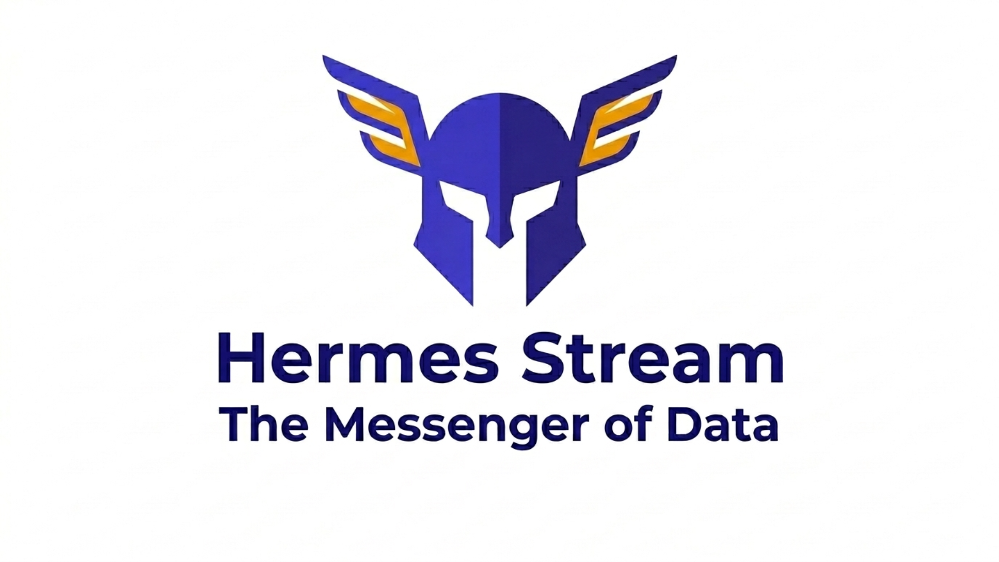

<p align="center">
  
</p>

<h1 align="center">Hermes Stream</h1>

<p align="center">
  <strong>The Messenger of Data.</strong>
</p>

<p align="center">
  <a href="#quick-start">Quick Start</a> •
  <a href="#key-features">Features</a> •
  <a href="#architecture">Architecture</a> •
  <a href="docs/ARCHITECTURE.md">Full Docs</a> •
  <a href="ROADMAP.md">Roadmap</a>
</p>

<p align="center">
  
  
  
</p>

---

## What is Hermes?

Hermes is a **lightweight, open-source data processing platform** that tracks every data item through collection, analysis, and delivery — with visual recipe management for non-developers.

Think of it as **Apache NiFi's per-item tracking** + **n8n's visual UI** + **first-class reprocessing** — in a single, lightweight package.

### The Problem

| Tool | What's Missing |
|---|---|
| **Apache NiFi** | Heavy (JVM 2GB+), complex UI, Java-only plugins |
| **Airbyte** | EL only — no algorithm/processing stage |
| **n8n** | Not built for high-volume data, no per-item tracking |
| **Airflow/Dagster** | Developer-centric (Python code), task-level tracking only |
| **Benthos** | No UI, no item tracking, Go-only |

### Hermes Fills the Gap

```
                    Heavy / Complex
                         │
                    NiFi ●
                         │
              Kafka ●    │
             Connect     │     ● Airbyte
                         │
    Simple ──────────────┼──────────────── Rich UI
                         │
            Benthos ●    │         ● n8n
                         │
            Singer ●     │    ★ Hermes
                         │    (sweet spot)
                         │
                    Lightweight
```

---

## Key Features

### 🔍 Job-Level Tracking
Every data item (Job) is individually tracked through the entire pipeline. Know exactly what happened to each file, API response, or database record — when it was collected, how it was processed, and where it was delivered.

### 🎛️ Recipe Management for Non-Developers
Operators configure collection settings, algorithm parameters, and transfer options through a **visual web UI** — no code required. Recipes are version-controlled with full diff/compare history.

### ♻️ First-Class Reprocessing
Failed items can be reprocessed from any stage, with the original or updated recipe. Bulk reprocess hundreds of items with one click. No other platform does this well.

### 🔌 Language-Agnostic Plugins
Algorithm containers connect via **gRPC** — write plugins in Python, C#, R, Java, or any language. Plugins run in Docker containers, fully isolated from the core platform.

### 🔗 NiFi-Friendly
Existing NiFi flows continue running untouched. Hermes adds a management layer on top — Recipe UI, Job tracking, and reprocessing for your NiFi pipelines.

### 📊 Visual Pipeline Designer
Drag-and-drop pipeline assembly inspired by n8n. Click any stage to configure its Recipe with auto-generated forms (sliders, dropdowns, toggles).

### 🛡️ Production-Ready Resilience
Back-pressure, Dead Letter Queue, Circuit Breaker, Schema Evolution, disk-based Content Repository — all the patterns that mature platforms like NiFi implement internally.

### 🌐 Distributed Clustering
Scale from a single node to a multi-worker cluster. Coordinator election, automatic job reassignment on worker failure, and centralized log viewer.

---

## Quick Start

```bash
# Clone
git clone https://github.com/jinmma12/hermes-stream.git
cd hermes-stream

# Copy environment config
cp .env.example .env

# Run with Docker Compose
docker compose up -d

# Open Web UI
open http://localhost:3000

# API docs
open http://localhost:8000/docs
```

---

## Architecture

```
┌──────────────────────────────────────────────────────────────┐
│                     HERMES WEB UI (React)                     │
│  Pipeline Designer │ Recipe Editor │ Monitor │ Job Explorer   │
└────────────────────────────┬─────────────────────────────────┘
                             │ REST API + WebSocket
┌────────────────────────────▼─────────────────────────────────┐
│                      HERMES CORE (.NET)                       │
│                                                               │
│  Monitoring Engine ──→ Job Queue ──→ Processing Orchestrator │
│    File/API/DB/Kafka      │          Stage 1: COLLECT         │
│    watching               │          Stage 2: ALGORITHM       │
│                           │          Stage 3: TRANSFER        │
│                           │                                   │
│  Recipe Engine ──── Content Repository ──── TraceEvent Log   │
│  (versioned config)  (disk-based storage)  (provenance)      │
│                                                               │
│  Execution Dispatcher:                                        │
│    GRPC → Docker container │ HTTP → REST API                 │
│    NIFI → NiFi flow        │ PLUGIN → subprocess             │
└────────────────────────────┬─────────────────────────────────┘
                             │
              ┌──────────────┼──────────────┐
              ▼              ▼              ▼
        ┌──────────┐  ┌──────────┐  ┌──────────┐
        │PostgreSQL│  │  Kafka   │  │  NiFi    │
        │          │  │(optional)│  │(optional)│
        └──────────┘  └──────────┘  └──────────┘
```

---

## Core Concepts

```
Job          "What to collect" — a tracking unit with its own Recipe
               e.g., Order Sync, Log Aggregation, Report Generation

Target       "Where to collect from" — sources within a Job
               e.g., Server A, Region US-East, Source DB-2

Recipe       Processing configuration — versioned, diffable
               e.g., { threshold: 3.5, method: "z-score" }

Pipeline     Processing flow — ordered Stages
               COLLECT → ALGORITHM → TRANSFER

Stage        Individual processing step within a Pipeline

Message      Data unit flowing between Stages
               content (on disk) + metadata (key-value)

TraceEvent   Processing history — provenance for every Message
               CREATED → COLLECTED → ANALYZED → SENT
```

---

## How It Works

```
1. Operator creates a Job via Web UI
   → Selects source type (File/FTP/API/DB/Kafka)
   → Configures Target paths and patterns
   → Sets Recipe parameters (threshold, algorithm, etc.)

2. Pipeline activates and starts monitoring
   → File appears / API changes / Kafka message arrives
   → Hermes creates a Job entry and begins processing

3. Data flows through Stages
   COLLECT  → gather data, store in Content Repository
   ALGORITHM → process via gRPC plugin (Docker container)
   TRANSFER → deliver to destination (DB/API/file/S3)

4. Everything is tracked
   → Every Stage records a TraceEvent
   → Recipe snapshot preserved at execution time
   → Full history available in Job Explorer

5. Failures? Just reprocess.
   → Click "Reprocess" on any failed Job
   → Choose: same Recipe or updated Recipe
   → Start from any Stage (skip already-succeeded Stages)
```

---

## Documentation

| Document | Description |
|---|---|
| [ARCHITECTURE.md](docs/ARCHITECTURE.md) | Full architecture specification |
| [V2_ARCHITECTURE.md](docs/V2_ARCHITECTURE.md) | Distributed system, resilience patterns |
| [DOTNET_SOLUTION_DESIGN.md](docs/DOTNET_SOLUTION_DESIGN.md) | C# project structure (Clean Architecture) |
| [DOMAIN_INTERFACES.md](docs/DOMAIN_INTERFACES.md) | Service interfaces and domain model |
| [DATA_COLLECTION_DESIGN.md](docs/DATA_COLLECTION_DESIGN.md) | Collection strategies and data formats |
| [MESSAGE_AND_TRACE.md](docs/MESSAGE_AND_TRACE.md) | Message flow and provenance design |
| [NIFI_INTEGRATION.md](docs/NIFI_INTEGRATION.md) | NiFi integration modes |
| [CLUSTER_DESIGN.md](docs/CLUSTER_DESIGN.md) | Distributed cluster and log viewer |
| [TEST_STRATEGY.md](docs/TEST_STRATEGY.md) | Testing approach (550+ scenarios) |
| [DEVELOPMENT_WORKFLOW.md](docs/DEVELOPMENT_WORKFLOW.md) | TDD, CI/CD, PR process |
| [ROADMAP.md](ROADMAP.md) | Phase 0-4 roadmap |

---

## Tech Stack

| Layer | Technology |
|---|---|
| **Core** | .NET 8 / ASP.NET Core |
| **Database** | PostgreSQL 15 (JSONB) |
| **ORM** | Entity Framework Core 8 |
| **Messaging** | Kafka (Confluent.Kafka) |
| **Plugin Protocol** | gRPC (protobuf) |
| **Resilience** | Polly (.NET resilience library) |
| **Web UI** | React 18 + TypeScript + Vite |
| **Visual Editor** | React Flow (@xyflow/react) |
| **Forms** | react-jsonschema-form (@rjsf) |
| **Styling** | Tailwind CSS |
| **Metrics** | Prometheus (prometheus-net) |
| **Logging** | Serilog |
| **Deployment** | Docker Compose / Kubernetes |

---

## Project Status

**Phase 0: Design** — Complete ✅

All architecture, design documents, gRPC protocols, domain interfaces, and test strategies are finalized. Python prototype with 550+ test scenarios validates the core concepts.

**Phase 1: MVP** — Starting

.NET implementation beginning. See [ROADMAP.md](ROADMAP.md) for full timeline.

---

## Contributing

We welcome contributions! See [DEVELOPMENT_WORKFLOW.md](docs/DEVELOPMENT_WORKFLOW.md) for:
- Test-driven development process
- PR checklist
- Code standards
- CI/CD pipeline

---

## License

[Apache License 2.0](LICENSE)

---

<p align="center">
  <sub>Built with ❤️ for data engineers who deserve better tools.</sub>
</p>
